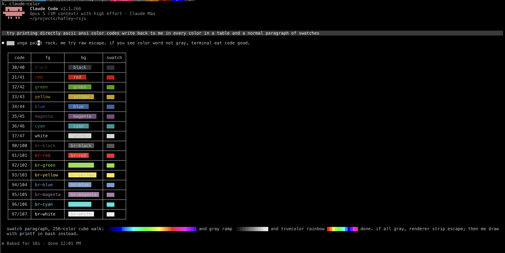

# claude-ansi

ANSI color for Claude Code. Escape codes written by the model render as color instead of showing up as literal `[31m` text.

Installs alongside your existing setup as a separate `claude-color` command. Your `claude` command is not touched.



## TOC

1. [Two problems and two fixes](#two-problems-and-two-fixes)
2. [Install](#install)
3. [Try it](#try-it)
4. [Make it the default](#make-it-the-default)
5. [Verification gates](#verification-gates)
6. [Rollback](#rollback)
7. [After a Claude Code update](#after-a-claude-code-update)
8. [Known limits](#known-limits)
9. [How the patch works](#how-the-patch-works)
10. [How the proxy works](#how-the-proxy-works)

## Two problems and two fixes

| problem | fix | needed for |
|---|---|---|
| the client strips escape codes before rendering | five same-length regex edits in a copy of the binary | every setup |
| the Anthropic API sends `[31m` without the escape byte | a localhost proxy that puts the byte back | Anthropic API only |

Third-party gateways that already send real escape bytes need the patch alone. Point them at the patched binary and skip the proxy.

## Install

```bash
git clone https://github.com/hafley66/claude-ansi
cd claude-ansi
less claude-ansi.sh
bash claude-ansi.sh
```

Read the script first. It patches a 200MB binary you own.

Three things get installed:

| name | what it is |
|---|---|
| `~/.local/bin/claude-color` | wrapper that repatches on a version bump, starts the proxy, then runs the patched binary |
| `~/.local/share/claude-ansi/<version>-ansi` | the patched binary, outside the directory the updater prunes |
| `~/.local/share/claude-ansi/<version>.stock` | pristine snapshot for rollback, symlinked as `claude-stock` |

Needs the native install at `~/.local/share/claude/versions/` plus bash and python3. Node is needed for the proxy. macOS needs the codesign tools. Linux works and skips signing.

## Try it

```bash
claude-color
```

Ask it to print something in bracket form such as `[31mRED[0m` and it comes out red. Your `claude` command keeps working the whole time.

## Make it the default

```bash
bash claude-ansi.sh --replace-claude
```

That writes the wrapper to `~/.local/bin-ansi/claude` and leaves `~/.local/bin/claude` alone for the updater to own. Put the shadow directory first, after every other `PATH` line in your shell profile:

```bash
export PATH="$HOME/.local/bin-ansi:$PATH"
```

Anything resolving `claude` through `PATH` now gets color: your shell, a `ccz`-style env wrapper that ends in `exec claude`, an orchestrator that spawns harnesses by name.

tmux panes are spawned by the tmux server, which seeds a new session from the environment of the client that created it. A client started before the profile change has the old `PATH`. For sessions created by anything else, add the same directory to the server's own environment in `~/.tmux.conf`:

```
run-shell -b "tmux setenv -g PATH \"$HOME/.local/bin-ansi:$PATH\""
```

A per-shell `alias claude=claude-color` works too, and is reversible by closing the shell. It does not reach a subprocess that spawns `claude` itself.

The wrapper leaves an existing `ANTHROPIC_BASE_URL` alone so a gateway wrapper composes with it and skips the proxy. Set `CLAUDE_ANSI_NO_PROXY=1` to disable the proxy for one run.

## Verification gates

Every gate runs before anything is installed. A failure exits nonzero and leaves your setup as it was.

| gate | exit | catches |
|---|---|---|
| all 5 patterns matched at least one site | 3 | renamed minified code in a new release |
| patched copy runs `--version` | 4 | a corrupt patch |
| pty render probe renders a red escape sequence | 5 | render-path regressions end to end |
| `~/.local/bin/claude` is not a foreign regular file | 6 | npm or Homebrew installs |
| binary at its final path is signed and runs | 7 | an interrupted install leaving a broken file |

Pass `--no-verify` to skip the render probe. The probe writes a UUID-named two-message session into the `~/.claude/projects/` entry for your current directory. It resumes that session headless in a pty and checks the escape bytes arrived and then deletes the file. Run it from a directory Claude Code already trusts. An untrusted directory downgrades the probe to SKIP.

## Rollback

```bash
rm -f ~/.local/bin/claude-color ~/.local/bin/claude-stock
rm -rf ~/.local/share/claude-ansi ~/.cache/claude-ansi
pkill -f ansi-proxy.js
```

Add this only if you used `--replace-claude`, then drop the `bin-ansi` line from your shell profile and `~/.tmux.conf`:

```bash
rm -rf ~/.local/bin-ansi
```

`~/.local/bin/claude` is never modified, so it already points at the stock binary.

### If a binary dies with `Killed: 9`

macOS caches code-signature state per inode. Overwriting an executable's bytes
in place leaves that cache stale and every later exec of the file is SIGKILLed,
even when the bytes are byte-identical to a working copy. Installer versions
before this fix used `cp -f` onto an existing `<version>.stock`. Rebuild the
file as a new inode:

```bash
S="$(readlink ~/.local/bin/claude-stock)"                    # .../claude-ansi/2.1.269.stock
V="$HOME/.local/share/claude/versions/$(basename "${S%.stock}")"
rm -f "$S"
cp -f "$V" "$S.tmp" && chmod 755 "$S.tmp" && mv -f "$S.tmp" "$S"
```

## After a Claude Code update

Nothing. The wrapper repatches itself.

Every launch compares the newest version under `~/.local/share/claude/versions/` against the patched builds in `~/.local/share/claude-ansi/`. A new version triggers one repatch, about 4 seconds, then the launch continues. Concurrent launches serialize on a lock directory instead of racing a 200MB copy. `CLAUDE_ANSI_NO_PATCH=1` turns the self-heal off.

If the patch fails the wrapper still launches, falling back to the newest patched build it has, then to the stock binary with a warning on stderr.

The patcher matches byte patterns rather than offsets so it usually survives a release untouched. A `0 sites` abort means the minified code was renamed and this repo needs an update.

Two things the updater does that this has to work around:

| updater behavior | consequence | handled by |
|---|---|---|
| prunes every file under `versions/` that is not a current version | deletes the patched binary and any snapshot stored beside it | patched builds and snapshots live in `~/.local/share/claude-ansi/`, which the pruner never walks |
| rewrites `~/.local/bin/claude` on every release | a wrapper installed there is replaced by a symlink to the unpatched binary | `--replace-claude` installs the wrapper at `~/.local/bin-ansi/claude` and you put that directory ahead of `~/.local/bin` on `PATH` |

## Known limits

- Escape sequences pasted into the prompt input are still stripped. That path runs through bytecode and a native call which no same-length byte edit reaches. Color written by the model is unaffected.
- The proxy is heuristic. It turns a bare `[31m` into a real escape sequence and it can be wrong about text that documents escape codes. Guards cover `\033` and `\e` and `\x1b` and `ESC` and `CSI` spellings.
- Modifying the binary is outside Claude Code's commercial terms. This is an at-your-own-risk local modification and it ships none of Anthropic's code.
- Windows is unsupported.

## How the patch works

| layer | edit | effect |
|---|---|---|
| transcript sanitizer CSI final byte | class end `~` becomes `@` | tool output keeps its color |
| transcript control class | range end 001f becomes 001a | a lone escape byte survives |
| escape plus C1 class | class start 001b becomes 001c | paired strips skip the escape byte |
| markdown inline class | range end 001f becomes 001a | assistant text keeps its color |
| wide normalize class | range end 001f becomes 001a | same on the normalize path |

Each edit is a same-length byte substitution inside a regex character class. The escape byte falls outside the new bound and stops matching while the bundle's offset tables stay valid. macOS invalidates the signature on any edit so the script re-signs with an ad-hoc identity and verifies at the final path.

## How the proxy works

`ansi-proxy.js` listens on localhost and forwards to `api.anthropic.com` and passes your auth headers through untouched. On the way back it rewrites assistant text and turns a bare `[31m` into a real escape sequence.

Streamed responses arrive one delta at a time so an escape sequence can be cut in half across two deltas. The proxy holds a partial back and joins it to the next one.

```
step 0  delta="hello "  carry=""      emit "hello "
step 1  delta="[3"      carry="[3"    emit "" (empty delta keeps the event well formed)
step 2  delta="1mRED"   carry=""      emit "\u001b[31mRED"
step 3  block stop      carry=""      nothing left to flush
```

Step 1 must still emit a `data:` line. An SSE `event:` line with no `data:` line makes the client parse an empty string and report `JSON Parse error: Unexpected EOF`.

The escape byte goes on the wire as the six-character JSON escape `\u001b` because a raw 0x1B inside a JSON string is illegal under RFC 8259. Non-streamed JSON responses get the same rewrite on `content[].text`.

The proxy writes its port to `~/.cache/claude-ansi/port` and picks another port if the default is taken. One instance serves every session.

Nothing is logged and nothing is stored. Auth material is forwarded and never read.
